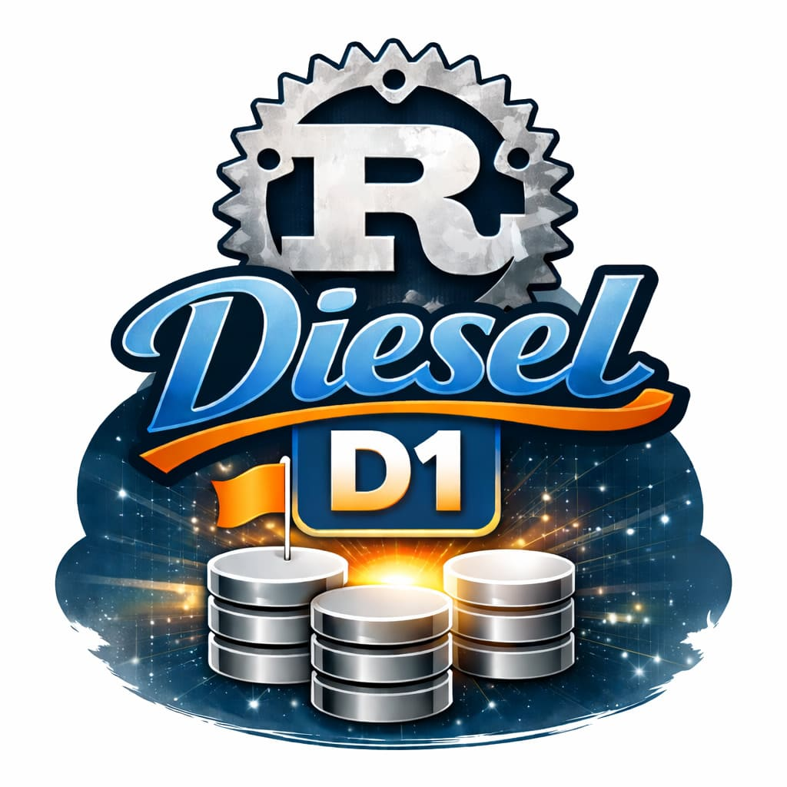

A production-grade extension of `diesel-d1` that enables **Cloudflare D1 access outside Workers via the HTTP REST API**, and adds **full transaction support with nested depth tracking**.

This crate allows you to use Cloudflare D1 as a first-class backend for Diesel and `diesel_async` in:

* Cloudflare Workers (WASM binding)
* Any Rust runtime (native, server, CLI, microservices) via D1 REST API

---

## ✨ Features

### 1. HTTP Backend (`http` feature)

Use D1 from any Rust environment through Cloudflare’s REST API.

* `D1HttpConnection` powered by `reqwest`
* `D1HttpConfig` for account / database / token
* URL-based connection string:

```
d1://account_id:api_token@database_id
```

Example:

```rust
use diesel_d1::{D1HttpConfig, D1HttpConnection};
use diesel_async::AsyncConnection;

let config = D1HttpConfig::new("account_id", "database_id", "api_token");
let mut conn = D1HttpConnection::new(config);

// Or via URL
let mut conn = D1HttpConnection::establish("d1://account:token@database").await?;
```

---

### 2. Transaction Support (Nested, Async, Diesel-Compatible)

Full implementation of `diesel_async::TransactionManager`:

* `D1TransactionManager`
* `begin / commit / rollback`
* Nested transaction depth tracking
* Automatic savepoint handling
* Deterministic rollback on failure

Guarantees:

* Atomic multi-statement execution
* Proper isolation semantics
* Correct behavior across nested scopes

---

### 3. Feature Flags

```toml
# Cloudflare Workers (WASM binding)
diesel-d1 = { version = "0.1", features = ["wasm"] }

# Native / Server / CLI via D1 REST API
diesel-d1 = { version = "0.1", features = ["http"] }
```

Switching backends requires no query-level changes.

---

### 4. Testing & CI

* 48+ unit and integration tests
* Coverage across:

  * SQL type mapping
  * Query builder
  * HTTP transport
  * Transaction manager
  * Error propagation
* GitHub Actions CI matrix:

  * `wasm` feature (Workers runtime)
  * `http` feature (native async runtime)

Planned test environment support:

* Wrangler + Miniflare (local Workers simulation)
* Cloudflare Workers Vitest runtime
* Native REST API integration tests

---

## Architecture

```
diesel-d1
├── wasm backend        (Workers binding)
├── http backend        (REST API via reqwest)
├── unified query layer (Diesel / diesel_async)
└── transaction engine (nested, async, savepoint-aware)
```

Both backends implement the same Diesel traits, allowing transparent portability between:

* Edge Workers
* Server backends
* Batch jobs
* CLI tools
* Migrations
* Test harnesses

---

## Examples

The `examples/` directory contains:

* `workers.rs` – D1 via WASM binding inside Cloudflare Workers
* `http.rs` – D1 via REST API from native Rust

---

## Roadmap

* Connection pooling
* Statement caching
* Prepared query reuse
* Tracing + OpenTelemetry spans
* Deterministic replay for transaction testing
* Cloudflare Zero Trust auth integration

---

## Why This Exists

The original `diesel-d1` was handy for some specific WASM, but until now:

* It was Workers-only
* It had no true transactional semantics
* It could not be used by standard Rust services
* It lacked async Diesel compatibility outside WASM

This project turns D1 into a **real distributed SQL backend** usable across:

* Edge
* Cloud
* CI
* Local dev
* Enterprise Rust stacks


## TO-DO List

- [x] proper "transaction" support
- [x] make it more SQLite compatible
- [x] HTTP API (and allow other targets that do not use WASM)
- [ ] Durable Object sync SQLite support

---

## License

Apache 2.0
